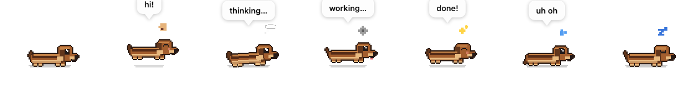

# 🐾 Copilot Pet

A native macOS desktop companion (inspired by [pets-therapy.com](https://pets-therapy.com/)) that
reacts to what GitHub Copilot is doing. It runs as a **user-scoped Copilot extension** and renders a
**pixel-art dachshund** you can **drag anywhere** on your desktop (its position is remembered). It
**watches your cursor** when it comes near, **glances around** on its own — looking left, right, or
straight at you — and you can **click it to pet it** for a happy little wriggle.



| When Copilot… | The pet… |
| --- | --- |
| Starts a session | 🐶 **greets** you 👋 (happy eyes, tail wagging) |
| Receives a prompt | 🐶 **thinks** 💭 (head tilts) |
| Runs a tool | 🐶 **works** ⚙️ (pants, tongue out; bubble names the tool) |
| Finishes the whole task | 🐶 is **happy** ✨ (bounces, tail wags fast) |
| Hits an error / failure | 🐶 gets **worried** 💦 (brow up, tail tucked) |
| Goes idle | 🐶 waits (gentle breathing) with occasional antics — a stretch, yawn, ear-scratch, sniff, dig, tail-chase or sit — then 😴 **sleeps** after ~18s |
| You move the cursor near | 🐶 **watches your pointer** 👀 (eyes track it, head turns) |
| You click it | 🐶 gets **petted** 💗 (blushes, hops, tail wags fast) — a click, not a drag |

## Animation & accessibility

The pet respects **Reduce Motion** (System Settings → Accessibility → Display), or the `reduceMotion`
override in [`config.json`](docs/config.md) — either one stills it. When active, non-essential
bobbing/tilting/trembling is damped to ~15% of normal, and binary accessory animation (gear spin,
sparkle pulse) is frozen outright — expressions (eyes, mouth, accessory, speech bubble) are unaffected
and stay fully readable.

Redraw cadence is also throttled to save CPU: 30 FPS while actively animating (greet/thinking/
working/happy/worried), dropping to 5 FPS when calm (idle/sleeping); with Reduce Motion on, 10 FPS
active / 2 FPS calm. While the window is hidden or occluded (covered by another window / on
another Space), it ticks at ~5 FPS just to poll state and the heartbeat — no animation, no redraw.

## Install / activate

This extension lives in `~/.copilot/extensions/copilot-pet/`. It is discovered automatically by the
GitHub Copilot app / CLI. After any change, reload it:

- From the agent: `extensions_reload`
- Or restart the app, or `/clear` the session.

On first load it compiles `pet.swift` + `PetCore.swift` with `swiftc` (a few seconds) into `.bin/pet`,
then spawns it.

## Development

```sh
# build the pet
swiftc pet.swift PetCore.swift -o .bin/pet

# run the model unit tests
swiftc PetCore.swift Tests/PetCoreTests.swift -o /tmp/pettests && /tmp/pettests

# parse-check the extension
node --check extension.mjs
```

CI runs all three on every push (`.github/workflows/ci.yml`).

## Requirements

- macOS (uses AppKit)
- Xcode command-line tools (`swiftc`) — for the one-time compile
- Node.js runtime (provided by the Copilot app)

## Manual control

The extension registers a `pet_control` tool. Ask the agent things like *"hide the pet"*,
*"make the pet sleep"*, *"restart the pet"*. Actions: `mood`, `say`, `show`, `hide`, `quit`, `restart`.

## Configuration

The pet works with zero setup. To customize it, copy the template and edit any keys you like — all
optional, hot-reloaded while the pet is running:

```sh
cp ~/.copilot/extensions/copilot-pet/config.example.json \
   ~/.copilot/extensions/copilot-pet/config.json
```

| Key | Default | Effect |
| --- | --- | --- |
| `size` | `62` | Pet size (points), `32`–`160`. |
| `lookAroundInterval` | `[4, 9]` | Seconds between glances (number or `[min, max]`). |
| `enabledBehaviors` | `["lookAround", "bubbles"]` | Toggle glancing + cursor-watching / speech bubbles. |
| `muted` | `false` | Suppress all speech bubbles. |
| `reduceMotion` | `false` | Hold still (accessibility); combines with the OS Reduce Motion setting. |
| `breed` / `palette` | `dachshund` / `chestnut` | Reserved for personalization (parsed, not yet rendered). |

Missing keys fall back to defaults; an invalid file is ignored (the extension logs a warning). Full
reference: [`docs/config.md`](docs/config.md).

## Files

| File | Purpose |
| --- | --- |
| `extension.mjs` | The Copilot extension. Compiles + spawns the pet, maps Copilot events → moods. |
| `PetCore.swift` | Pure model — `Mood`, `Pose`, `DogFeatures`, `Cadence`, `PetConfig` (no AppKit). Unit-tested. |
| `pet.swift` | AppKit overlay window + pixel-art rendering, driven by `Pose`; schedules ticks dynamically via `Cadence` and hot-reloads `config.json`. |
| `config.example.json` | Copy to `config.json` to customize the pet (git-ignored). |
| `Tests/PetCoreTests.swift` | Unit tests for `Pose.make` / `Mood.autoNext` / `Cadence` / `PetConfig.parse`. |
| `.bin/pet` | Compiled binary (git-ignored, rebuilt on demand). |
| `docs/` | Full knowledge dump — see below. |

## Documentation

- [`docs/config.md`](docs/config.md) — the `config.json` settings file: keys, defaults, hot-reload.
- [`docs/copilot-extensions.md`](docs/copilot-extensions.md) — how Copilot extensions work (architecture, discovery, lifecycle).
- [`docs/sdk-reference.md`](docs/sdk-reference.md) — the `@github/copilot-sdk` API: `joinSession`, hooks, session object, events.
- [`docs/architecture.md`](docs/architecture.md) — this pet's design, IPC protocol, and decisions.
- [`docs/development.md`](docs/development.md) — how to modify, compile, test, and debug.

## Auto-cleanup

The extension writes a `heartbeat` timestamp every 5s. If the app/session closes (extension process
dies), the heartbeat goes stale and the pet **self-terminates within ~12s**. It reappears next time
the extension loads. No orphan processes.
